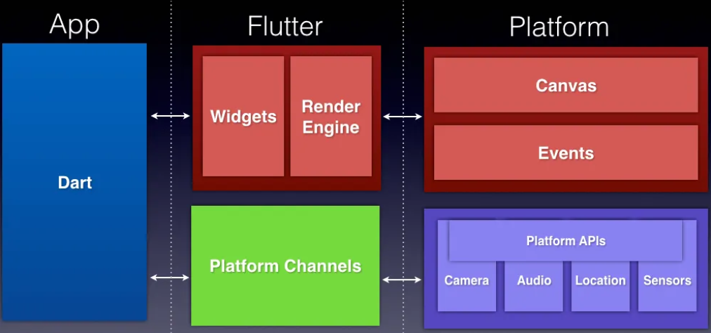

# Mobile App Development

---

# Flutter

---

# What is Flutter?

- Open-source UI software development kit (SDK)
- Allows developers to build native-quality applications for mobile, web, and desktop platforms from a single codebase.

---

# Flutter Architecture

---

# Flutter Components

- Widgets

  - Building blocks of Flutter applications.
  - Everything in Flutter is a widget, whether it’s a button, a layout, or an entire screen.
  - Widgets can be either stateless or stateful, enabling developers to create interactive and dynamic user interfaces.

---

# Flutter Components

- Rendering Engine
  - Responsible for drawing the widgets on the screen.
  - Flutter uses its own rendering engine called Impeller, which allows for high-performance graphics and smooth animations.

---

# Flutter Components

- Platform Channels
  - Enable communication between the Flutter app and the native platform APIs.
  - Allow developers to access platform-specific features and services, ensuring a seamless user experience.

---
