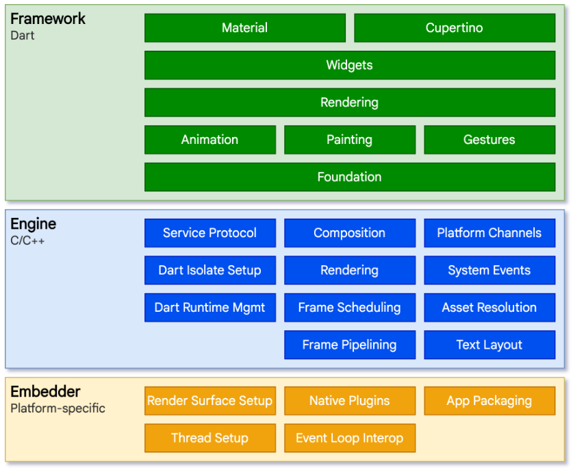
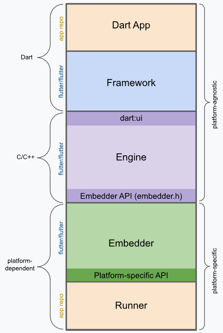

<style>
@import url('https://fonts.googleapis.com/css2?family=Prompt:ital,wght@0,100;0,300;0,400;0,700;1,100;1,300;1,400;1,700&display=swap');

    :root {
    font-family: Prompt;
    --hl-color: #D57E7E;
}
h1 {
  font-family: Prompt
}
</style>

# Mobile App Development

---

# Flutter Basics

---

# Getting Started

- `flutter doctor`
- `flutter emulators`
- `flutter emulator --launch <emulator id>`
- `flutter create <project name>`

- VSCode
  - Settings `Dart: Hot Reload On Save` > `All`
  - Ctrl + P > `Flutter: Select Device` > `<device>`
- `flutter run`

---

# While you wait...

---

# What is Flutter?

- Open-source UI software development kit (SDK)
- Allows developers to build native-quality applications for mobile, web, and desktop platforms from a single codebase.

---

# How Flutter Works

- During development, Flutter apps run in a VM that offers stateful hot reload of changes without needing a full recompile.
- For release, Flutter apps are compiled directly to machine code, whether Intel x64 or ARM instructions, or to JavaScript if targeting the web.

---

# Architecture of Flutter

> [Source](https://docs.flutter.dev/resources/architectural-overview)

---



---

# Embedder

- A thin layer of code that allows Flutter to run on different platforms.
- Handles tasks such as creating a window, setting up the rendering surface, and managing input events.
- Each platform (iOS, Android, Windows, macOS, Linux, web) has its own embedder implementation.
- The embedder communicates with the Flutter engine to facilitate rendering and input handling.

---

# Flutter Engine

- The Flutter engine is responsible for rendering the UI and handling the core functionality of Flutter applications.
- It is written primarily in C++ and provides low-level rendering support.
  - It uses [Impeller](https://docs.flutter.dev/perf/impeller), a hardware-accelerated 2D graphics engine, to render graphics efficiently.
- The engine also manages the Dart runtime, which executes the Dart code written by developers.
- The engine is exposed to the Flutter framework through [dart:ui](https://api.flutter.dev/flutter/dart-ui/dart-ui-library.html) library.

---

# Flutter Framework

- The Flutter framework is a collection of libraries and tools that provide a high-level API for building Flutter applications.

---

# Flutter Framework - Layers

- [Foundational classes](https://api.flutter.dev/flutter/foundation/)
  - Such as `ChangeNotifier`, `ValueNotifier`, and `InheritedWidget` help manage state and data flow within the app.
- [Rendering layer](https://api.flutter.dev/flutter/rendering/)
  - Such as `RenderObject`, `RenderBox`, and `RenderFlex` handle the layout and painting of widgets on the screen.

---

# Flutter Framework - Layers (contd.)

- [Widget Layer](https://api.flutter.dev/flutter/widgets/)
  - Such as `StatelessWidget`, `StatefulWidget`, and `InheritedWidget` provide the building blocks for creating user interfaces.
- [`Material`](https://api.flutter.dev/flutter/material/) and [`Cupertino`](https://api.flutter.dev/flutter/cupertino/) libraries
  - Provide pre-designed widgets that follow the Material Design and iOS design guidelines, respectively.

---

# Material vs Cupertino

- `Material`: A set of Flutter widgets that implement Google's Material Design language.
- `Cupertino`: A set of Flutter widgets that implement the iOS design language.
- When to use which?

  - All pltforms: Material
  - iOS only: Cupertino

> _You can technically run a Cupertino app on either Android or iOS, but Cupertino won't have the correct fonts on Android._

---

# You can mix-and-match!

- You can check the platform at runtime and use the appropriate widgets.

```dart
if(Platform.isIOS){
   return CupertinoButton(); // iOS style button
} else if(Platform.isAndroid) {
    return ElevatedButton(); // Material design button
}
```

---

# Anatomy of a Flutter App



---

# Anatomy of a Flutter App

- Dart App
  - What we write.
- Framework
  - Composites the app's widget tree into a scene.
- Engine
  - Renders the scene to the screen.
- Embedder
  - Hosts the engine on a specific platform.
- Runner
  - Platform-specific entry point for the app.

---

# Widget

- The basic building block of a Flutter app's user interface.
- Everything in Flutter is a widget, from layout structures to UI controls.
- Each widget is an immutable declaration of part of the user interface

---

# Building Widgets

- You determine the visual representation of a widget by overriding the `build()` function.
- A widget's build function should be free of side effects.
- The `build` function can be called multiple times, so it should be efficient (no heavy computations) and free of side effects.

---

# Are we done yet?
