<style>
@import url('https://fonts.googleapis.com/css2?family=Prompt:ital,wght@0,100;0,300;0,400;0,700;1,100;1,300;1,400;1,700&display=swap');

    :root {
    font-family: Prompt;
    --hl-color: #D57E7E;
}
h1 {
  font-family: Prompt
}
</style>

# Mobile App Development

---

# Stateless vs Stateful Widget

---

# Stateless Widget

- Immutable
- Build once
- No internal state to manage
- Example: `Text`, `Icon`, `RaisedButton`
- Use when UI does not change dynamically

---

# Stateful Widget

- Mutable
- Can rebuild multiple times
- Maintains internal state
- Example: `Checkbox`, `TextField`, `Form`
- Use when UI changes dynamically
- Requires `State` class to manage state

---

# Flutter Widget Tree

[From Widget to Element](https://docs.flutter.dev/resources/architectural-overview#build-from-widget-to-element)

---

# Widget Tree

- Widgets are immutable descriptions of part of a user interface.
- The widget tree is a hierarchical structure of widgets that defines the layout and behavior of the UI.
- Widget are created from `build()` methods.

---

# Widget Tree

```dart
Container(
  color: Colors.blue,
  child: Row(
    children: [
      Image.network('https://www.example.com/1.png'),
      const Text('A'),
    ],
  ),
);
```

- Note `Container` class is a `StatelessWidget` which has `build()` method that returns other widgets.

---

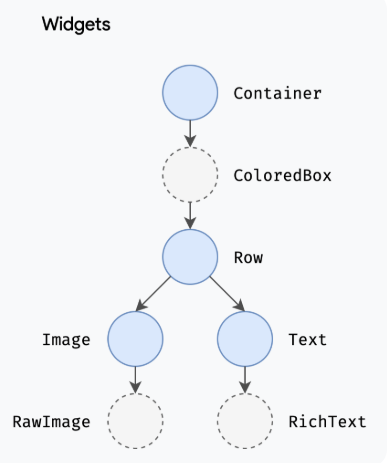

---

# Element Tree

- Elements are the instantiation of widgets at runtime.
- The element tree is a hierarchical structure of elements that represents the current state of the UI.
- Elements are created from widgets during the build process.
  - Using [`createElement()`](https://github.com/flutter/flutter/blob/8b7834766f722d7cb49f660265396a7e859857d9/packages/flutter/lib/src/widgets/framework.dart#L349C2-L349C27) method of the widget.

---

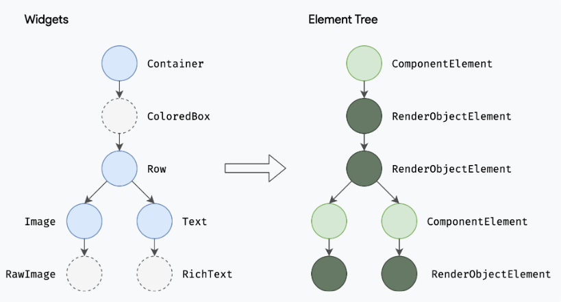

`ComponentElement`: a host for other elements.
`RenderObjectElement`: an element that participates in the layout or paint phases.

---

# Render Tree

- Render objects are responsible for layout, painting, and hit testing.
- The render tree is a hierarchical structure of render objects that defines how the UI is drawn on the screen.
- Render objects are created from elements during the build process.
  - Using [`createRenderObject()`](https://github.com/flutter/flutter/blob/8b7834766f722d7cb49f660265396a7e859857d9/packages/flutter/lib/src/widgets/framework.dart#L1912) method of the element.

---

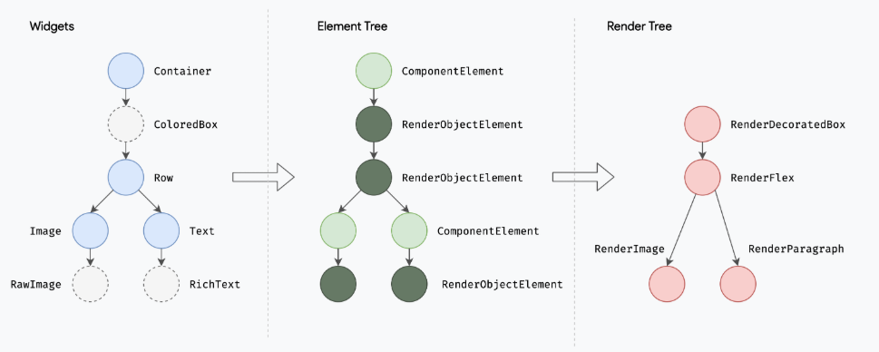

---

# Summary

- **Widget tree**: Immutable descriptions of the UI.
- **Element tree**: Runtime instances of widgets.
- **Render tree**: Objects responsible for layout and painting.

---

# Flutter Stateless Widget Lifecycle

---

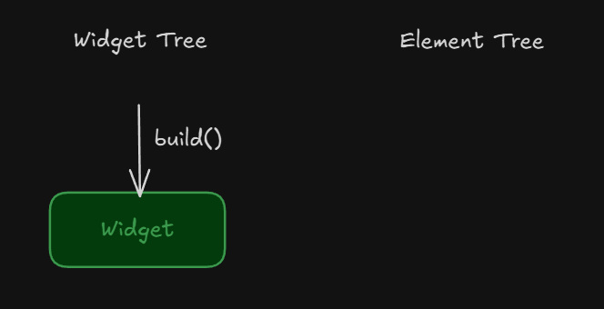

A widget is created through `build()` method.

---


- The framework calls the [`createElement()`](https://github.com/flutter/flutter/blob/8b7834766f722d7cb49f660265396a7e859857d9/packages/flutter/lib/src/widgets/framework.dart#L531) method to create an element for the widget.
  - The element called the `mount()` method to attach itself to the render tree.
- The element calls the `createRenderObject()` method to create a render object for the element.

---

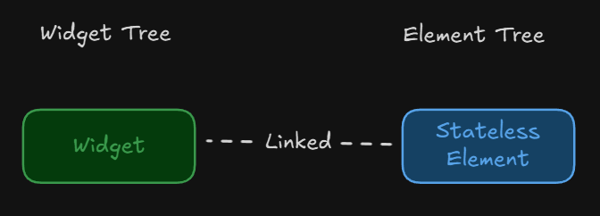

The element maintains a link to the corresponding widget under the instance attribute called `widget`.

---

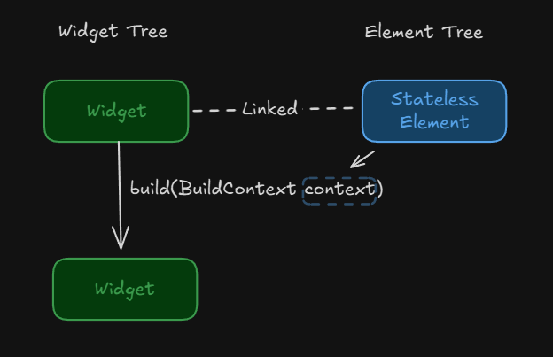

- The framework calls the `build()` method of the widget to create child widgets.
- The element is injected into the `build()` method as the `BuildContext` parameter.
  - A new widget is created.

---

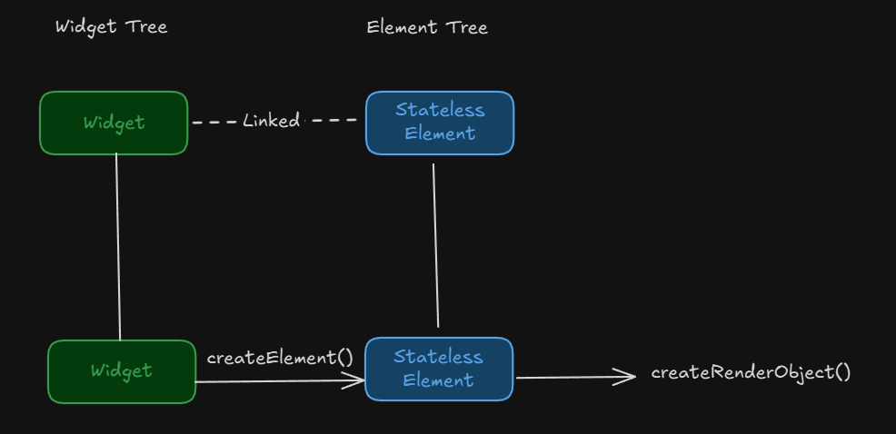
The process continues recursively for child widgets.

---

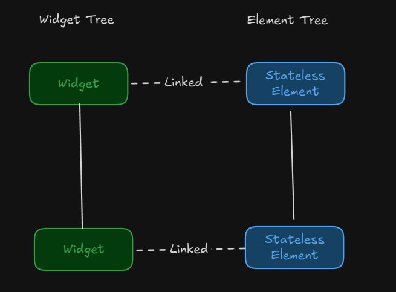
The process continues recursively for child widgets.

---

# Rebuild of Stateless Widget

- Parent widget rebuilds and creates a new instance of the stateless widget.
- The framework calls the `update()` method of the element to update the element with the new widget.
- The element calls the `updateRenderObject()` method to update the render object if necessary.
- The element calls the `build()` method of the new widget to create child widgets.

> Notice that the element is reused; it is not recreated.

---

# Question

- If the widget is built from the parent's `build()` method, where is the first build method called?

---

# Answer

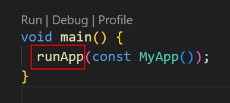

The first `build()` method is called from the `runApp()` function, which initializes the widget tree.

---

# Lifecycle of Stateful Widget

- Similar to stateless widget but with additional state management.
- The state is managed by a separate `State` class.
- The `State` class has its own lifecycle methods, such as `setState()`.

---

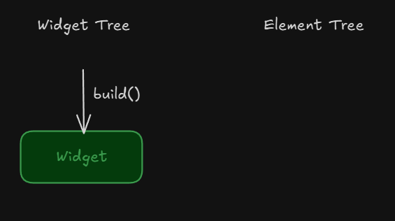
A widget is created through `build()` method.

---

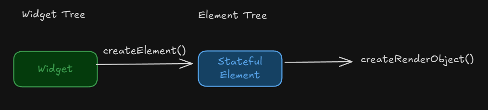
Element and render object are created similarly to stateless widget.

---

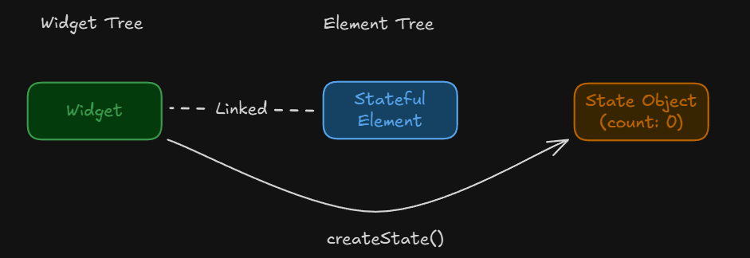
Here, the framework creates a `State` object for the stateful widget by calling the `createState()` method.

---

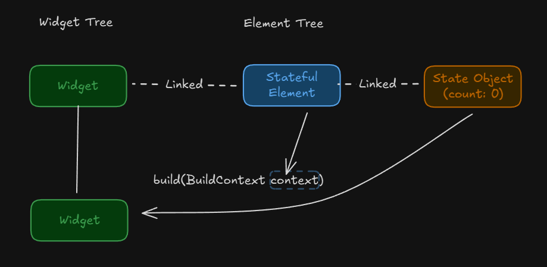

- The framework calls the build method of the state object to create child widgets.
- The element is again injected into the `build()` method.

---

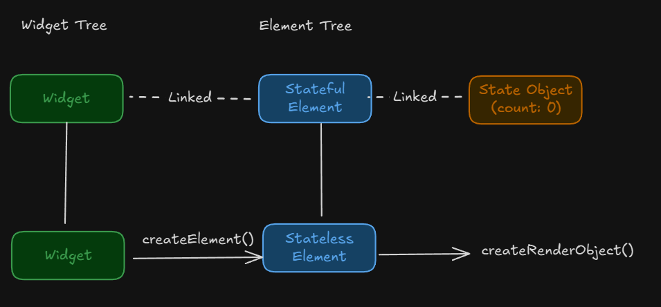

The process continues recursively for child widgets.

---

# What happens when `setState()` is called?

- The `setState()` method notifies the framework that the internal state of the widget has changed.
- The framework schedules a rebuild of the widget by calling the `build()` method of the state object.
- The element and render object are updated similarly to stateless widget rebuild.

> Notice that the element and state object are reused; they are not recreated. This maintains the state across rebuilds.

---

# Resources

- [Flutter Widget 101](https://www.youtube.com/watch?v=CXedqMlLo7M&list=PL-B0-NEYQT8dMVGTVYKv0sv_NOg--wtx1)
- [How flutter renders widgets](youtube.com/watch?v=996ZgFRENMs&si=qyhA_8pwNLgK4PTj)
- [Beginning Flutter](https://youtu.be/4W8eN_6mO2E?si=gG876ljs_XdJnVQq)
