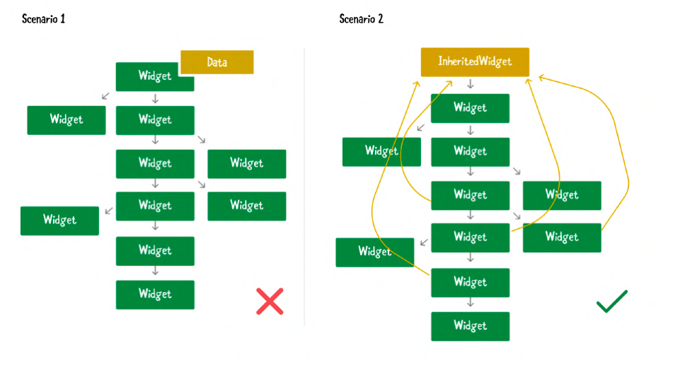

# Mobile App Development

---

# Inherited Widget

---

# What is Inherited Widget?

- A special type of widget that allows data to be passed down the widget tree.
- Enables child widgets to access shared data without needing to pass it through constructors.
- Useful for managing state that needs to be accessed by multiple widgets.

---

---

# Inherited Application

- Theme
- MediaQuery
- Provider packages (e.g., Riverpod, Provider)
- Navigator
