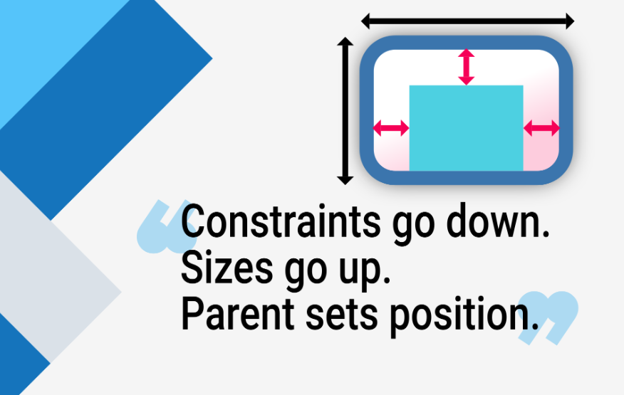
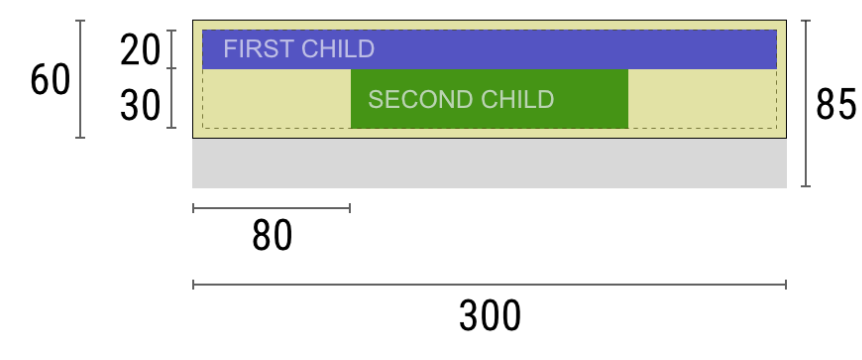

# Mobile App Development

---

# Constraints

---

# Why Talking About Constraints?

- Flutter layout is very different from HTML layout.
  - In HTML, elements can size themselves based on content
  - In Flutter, the parent widget imposes constraints on its children.
- Understanding constraints is crucial for building responsive UIs in Flutter.

---

---

# How Layout Works in Flutter

- A widget gets its own constraints from its parent.
- A constraint is 4 `doubles`.
  - A minimum and maximum width
  - A minimum and maximum height.

---

# How Layout Works in Flutter (Contd.)

The widget goes through its own list of children.

1. The widget tells its children what their constraints are
2. Asks each child what size it wants to be.
3. The widget positions its children (horizontally in the x axis, and vertically in the y axis), one by one.
4. The widget tells its parent about its own size (within the original constraints, of course).

---

# Example

- Widget contains a column with some padding
  

---

# Widget

> "Hey parent, what are my constraints?"
> 

---

# Parent

> "You must be from 0 to 300 pixels wide, and 0 to 85 tall."
> 

---

# Widget

> "I need 5 pixels of padding, then my children can have at most 290 pixels of width and 75 pixels of height."
> 

---

# Widget

> "Hey first child, You must be from 0 to 290 pixels wide, and 0 to 75 tall."
> 

---

# First Child

> "OK, then I wish to be 290 pixels wide, and 20 pixels tall."
> 

---

# Widget

> "Hmmm, since I want to put my second child below the first one, this leaves only 55 pixels of height for my second child."

> 

---

# Widget

> "Hey second child, You must be from 0 to 290 wide, and 0 to 55 tall."

> 

---

# Second Child

> "OK, I wish to be 140 pixels wide, and 30 pixels tall."

> 

---

# Widget

> "Very well. My first child has position `x: 5` and `y: 5`, and my second child has `x: 80` and `y: 25`."

> 

---

# Widget

> "Hey parent, I've decided that my size is going to be 300 pixels wide, and 60 pixels tall."

> 

---

# Limitations

- Flutter's layout engine is designed to be a one-pass process.
- Widgets must always respect the constraints given by their parent.
  - Widget cannot have any size it wants.
- A widget can't know and doesn't decide its own position in the screen.
  - Only the parent widget decides where to position its children.

---

# Constraints Behavior

- Widgets are rendered by their underlying `RenderBox` objects.
- There are three kinds of boxes.
  - Those that try to be as big as possible.
    - `Center` and `ListView`.
  - Those that try to be the same size as their children.
    - `Transform` and `Opacity`.
  - Those that try to be a particular size.
    - `Image` and `Text`.

---

# Side Note

- Some widgets, for example `Container`, vary from type to type based on their constructor arguments.
- The Container constructor defaults to trying to be as big as possible.
- But if you give it a `width`, it tries to be that particular size.
- If you give it a `child`, it tries to be the same size as its child.

---

# Tight / Loose Constraints

- **Tight Constraints**: When the minimum and maximum values for width and height are equal. The widget must be exactly that size.
- **Loose Constraints**: When the minimum and maximum values for width and height are different. The widget can choose any size within that range.

---

# Unbounded Constraints

- When the maximum value for width or height is infinite. The widget can grow indefinitely in that dimension.
  - Flexbox's `Expanded` and `Flexible` widgets often create unbounded constraints.
- A box that tries to be as big as possible won't function usefully when given an unbounded constraint.
  - For example, a `ListView` inside a `Column` without a fixed height

---

# Resources

- https://docs.flutter.dev/ui/layout/constraints
- https://medium.com/flutter-community/flutter-layout-cheat-sheet-5363348d037e
